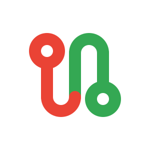
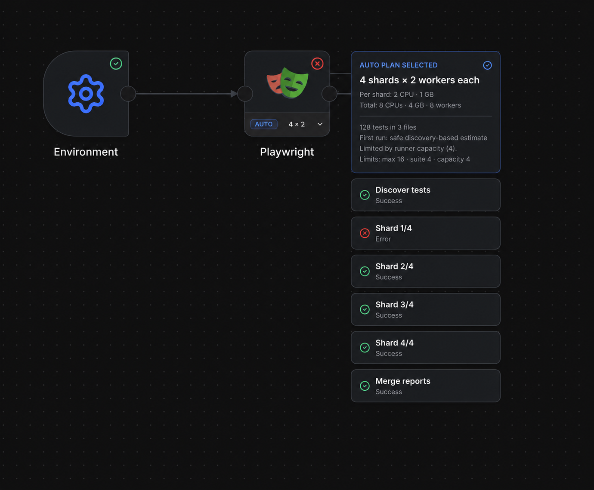
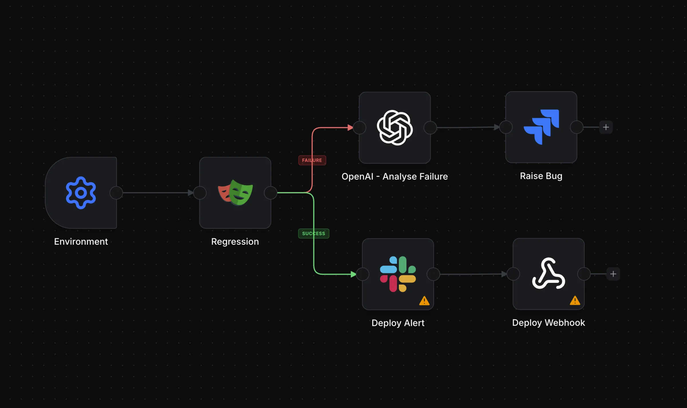

<p align="center">
  
</p>

<h1 align="center">Playrunner</h1>

<p align="center">
  <strong>Run Playwright at scale—without building the platform around it.</strong>
</p>

<p align="center">
  Keep the tests and CI you already use. Bring runners, environments,
  credentials, reports, integrations, and automatic sharding into one visual
  workflow.
</p>

<p align="center">
  <a href="https://playrunner.cloud"><strong>Try Playrunner Cloud →</strong></a>
  &nbsp;&nbsp;·&nbsp;&nbsp;
  <a href="https://playrunner.dev/docs/tutorials/getting-started">Run it locally</a>
  &nbsp;&nbsp;·&nbsp;&nbsp;
  <a href="https://playrunner.dev/docs/overview/">Read the docs</a>
</p>

<p align="center">
  <a href="https://playrunner.dev/docs/overview/"></a>
  <a href="https://discord.gg/4zPdBy3DwU"></a>
  <a href="https://www.npmjs.com/org/playrunner"></a>
</p>

<br />



<p align="center">
  <em>One Playwright node. Four concurrent shards. One merged report—even when a shard fails.</em>
</p>

## Your tests stay. The platform glue goes.

Playwright runs your tests brilliantly. The hard part is everything around the
command: compute, environments, credentials, schedules, conditions, artefacts,
reporting, and the CI scripts that connect them.

Playrunner turns those moving parts into a workflow your whole team can see,
run, and evolve.

|                                      |                                                                                                                |
| ------------------------------------ | -------------------------------------------------------------------------------------------------------------- |
| **🎨 Build visually**                | Connect tests, triggers, conditions, branches, and downstream systems on a live workflow canvas.               |
| **⚡ Shard automatically**           | Discover the real suite, fit useful parallelism to runner capacity, and merge every shard into one report.     |
| **🏃 Run where you want**            | Use local Docker, managed cloud runners, or your own infrastructure without changing the suite.                |
| **🔎 See the complete run**          | Follow node state and logs live, with Playwright reports, screenshots, videos, and traces attached to the run. |
| **🔐 Keep secrets out of workflows** | Reuse managed environments and credentials instead of copying sensitive values into scripts.                   |
| **🧩 Extend with integrations**      | Wire source control, schedules, messaging, AI analysis, issue tracking, webhooks, and more into the same DAG.  |

## From suite to signal

```text
Trigger → Environment → Playwright → Condition → Slack / Jira / AI / Webhook
                              │
                              └── reports · traces · screenshots · video
```

1. **Bring your existing tests.** Your repository, Playwright configuration,
   and CI can stay as they are.
2. **Choose where they run.** Start with local Docker, then move execution to
   managed or self-hosted runners when you are ready.
3. **Draw the workflow.** Add schedules, branches, notifications, failure
   analysis, tickets, and downstream actions without another CI matrix.
4. **Inspect one complete result.** Follow execution live and keep every log,
   report, and artefact attached to the run that produced it.

<p align="center">
  
</p>

## Quick start

### Prerequisites

- Docker Desktop
- Node.js 20+
- npm

### Start the full local stack

```bash
./install-local.sh
cp .env.local.example .env.local
./start-local.sh
```

On the first run, Playrunner opens the setup app. Follow the printed URL to
confirm PostgreSQL and create the first admin account. With the default ports:

- Playrunner: `http://127.0.0.1:3100`
- Setup: `http://127.0.0.1:3100/setup`
- Documentation: `http://127.0.0.1:3104/playrunner/`

The `.env.local` file is optional unless you want to change ports before the
first run. If it is missing, `./start-local.sh` creates it from the example. For
the complete walkthrough, see the
[Getting Started guide](docs/docs/tutorials/01-getting-started.md).

<details>
<summary><strong>Reopen setup or change the local defaults</strong></summary>

To reopen the setup wizard:

```bash
rm apps/api/.env
./start-local.sh
```

Remove `.env.local` as well if you want Playrunner to regenerate the local port
and PostgreSQL defaults.

</details>

<details>
<summary><strong>Run only the documentation site</strong></summary>

```bash
cd docs
npm run start -- --port 3104
```

Then open `http://127.0.0.1:3104/playrunner/`.

</details>

## Explore

| Start here                                                                 | What you will find                                               |
| -------------------------------------------------------------------------- | ---------------------------------------------------------------- |
| [Automatic sharding](docs/docs/use-cases/automatic-playwright-sharding.md) | Suite discovery, capacity-aware planning, and report merging     |
| [Integration reference](docs/docs/integration-packages/index.md)           | Available nodes, providers, and configuration                    |
| [Runner architecture](docs/docs/runner-architecture/index.md)              | Local, managed, and self-hosted execution                        |
| [Workflow execution](docs/docs/local-dev/07-workflow-execution.md)         | How the API, orchestrator, and ephemeral runners coordinate      |
| [Contributing](docs/docs/contributing.md)                                  | Ways to extend runners, integrations, reporting, and the product |

## Package end-to-end tests

Package E2E tests run the real Vite frontend and Playrunner API against the
isolated `playrunner_e2e` PostgreSQL schema. Complete local setup first so
`apps/api/.env` contains a working `DATABASE_URL`, and keep PostgreSQL running.

Install Chromium once on a new development machine:

```bash
npm exec --prefix apps/frontend -- playwright install chromium
```

Run the deterministic mock-provider suite:

```bash
npm run test:e2e:mock
```

Run one integration package by its Playwright tag:

```bash
npm run test:e2e:mock -- --grep @github
npm run test:e2e -- --grep @github
```

Mock mode still uses the real frontend, authentication, API, credential
encryption, and database; only outbound provider boundaries may be faked.
Live-provider scenarios are opt-in and require protected credentials:

```bash
npm run test:e2e:live
npm run test:e2e:live -- --grep @github
```

Set `PLAYRUNNER_E2E_DATABASE_URL` to use another PostgreSQL server. Open the
latest report with `npx playwright show-report`, or read the
[Testing guide](docs/docs/testing/index.md) for architecture and package
authoring details.

## License

Playrunner is source-available under the [Playrunner Sustainable Use
License](LICENSE), copyright © 2026 Concept AI PTY LTD.

You can use and modify Playrunner for internal business purposes, or for
personal and other non-commercial use. You may not resell Playrunner, offer it
as a hosted or white-label service, or embed it into a commercial offering
where a material part of the value comes from Playrunner itself without
separate written permission.

This is not an OSI-approved open source license. See [LICENSE](LICENSE) for the
full terms.
