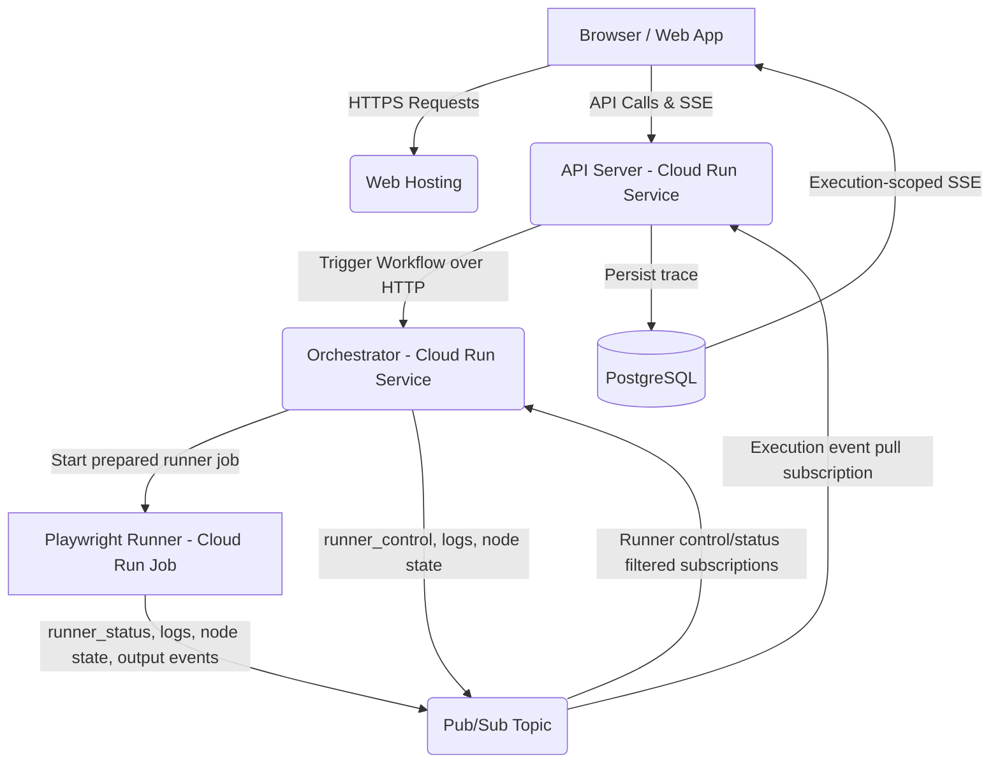

# Google Cloud Platform (GCP) Runner Architecture

Playrunner is designed to be easily deployable to Google Cloud Platform, providing a massively scalable, auto-scaling execution environment for your visual Playwright workflows.

Need the concrete setup flow? Start with [GCP Setup](./setup) for the
Terraform, saved GCP settings, and runner image publishing steps.

---

## Architecture at a Glance

When deployed to GCP, the local docker-based services are mapped directly to scalable serverless infrastructure:

## Service Breakdown

1. **API Server (Cloud Run Service)**: Handles HTTP requests from the frontend, manages authentication, proxies to Jira/Github integrations, persists every workflow event to PostgreSQL, and maintains Server-Sent Events (SSE) connections to stream live logs to the browser.
2. **Orchestrator (Cloud Run Service)**: A lightweight Node.js event-loop dispatcher that traverses your visual workflow graphs. It manages state, evaluates dependencies, prepares Playwright Cloud Run Jobs early, and signals them over Pub/Sub when their workflow node is ready to execute.
3. **Playwright Runner (Cloud Run Job)**: The heavy lifter. A Docker container bundled with browsers and the Playwright framework. The Orchestrator passes execution context (payloads, environment variables, event transport, and runner control metadata) to these Jobs.
4. **Pub/Sub**: The default and required GCP runner messaging transport. The Orchestrator and Playwright runner publish execution events to a topic. The API creates an execution-scoped pull subscription, writes execution events to PostgreSQL, then acknowledges them. Runner control/status messages also use the same topic, but they are consumed by the Orchestrator/runner path rather than stored as user-facing execution logs.

> **Runner messaging uses Pub/Sub.** GCP runners publish logs, node states, status, and output events to Pub/Sub. A local API can still debug cloud runs because it pulls Pub/Sub messages over outbound HTTPS; no tunnel is required. See [Remote Runner Messaging](../../local-dev/remote-debugging).

---

## Dynamic Provisioning & Authentication

A key benefit of the Playrunner architecture is that **you do not need to manually deploy the Orchestrator Service**.

What Playrunner does **not** do for you is build or push container images.
Cloud Run still needs published images for the Orchestrator service and the
Playwright runner jobs before runtime provisioning can succeed. The repo ships
`infra/gcp/scripts/push-runners.sh` to do this. For the full setup order, see
[GCP Setup](./setup). For script details, see
[Publishing to GCP](../../local-dev/docker-images#publishing-to-gcp).

When a user initiates a workflow from the web interface targeting GCP:

1. **On-the-fly Provisioning**: The Node.js API Server automatically checks if the `playrunner-orchestrator` Cloud Run Service exists in the user's selected GCP project. If not, it uses the `@google-cloud/run` SDK to dynamically create and configure the service on the fly.
2. **Stateless Authentication**: The API Server passes the workflow payload to the Orchestrator, which securely injects the user's OAuth2 access token into the payload.
3. **Impersonation-less Execution**: The Orchestrator, running in Cloud Run, uses this OAuth2 token to instantiate its own GCP clients (`JobsClient`, `ExecutionsClient`) and publish workflow events to Pub/Sub. This ensures that the Orchestrator runs exactly as the authenticated user, without requiring complex IAM role assignments to the default Compute Engine Service Account.

In practice that means:

- `GCP_ORCHESTRATOR_IMAGE_URI_TEMPLATE` must point at an Orchestrator image that is already available in a registry Cloud Run can pull from.
- `GCP_PLAYWRIGHT_IMAGE_URI_TEMPLATE` must point at Playwright runner images that are already available in a registry Cloud Run can pull from.
- `GCS_BUCKET_PREFIX` controls the per-workflow output buckets Playrunner creates before handing execution off to Cloud Run.
- The connected GCP user must have permission to publish Pub/Sub messages and create/use the execution event plus runner control/status subscriptions on the shared topic.

The Terraform under `infra/gcp` creates Artifact Registry repositories named
`orchestrator` and `playwright-runner`, plus the shared Pub/Sub workflow events
topic. The API creates and deletes execution-scoped filtered subscriptions on
that topic at runtime.

The GCP settings saved after OAuth are runtime pointers into that infrastructure.
The selected project and Cloud Run region should match the Terraform
`project_id` and `region`, and the saved image URI templates should render to
the Terraform-created Artifact Registry repository URLs. The setup runbook has
the exact matching checklist.

If those saved values change, publish the runners again so Cloud Run uses the
new image locations. Apply the `infra/gcp` Terraform first when the new project,
region, repository path, or workflow-events topic has not already been created.

---

## Workflow Execution Lifecycle

1. The editor sends `POST /api/workflows/start` to the API.
2. The API creates the workflow execution record, configures the execution-scoped Pub/Sub event subscription, ensures the Orchestrator Cloud Run service exists, and invokes the service's `/execute` endpoint.
3. The Orchestrator loads the full workflow, scans the entire graph for Playwright nodes, and starts their Cloud Run Jobs in preparation mode before the DAG reaches those nodes.
4. Each Playwright runner prepares dependencies, including repository checkout and package installation, then publishes a `runner_status` message such as `ready`. It does not start the Playwright test yet.
5. When DAG traversal reaches a Playwright node, the Orchestrator waits for the prepared runner to be ready, publishes a `runner_control` start message containing the `nodeId` and `testId`, then waits for the Cloud Run Job execution to complete.
6. The runner publishes `started`, node-state, log, output, and terminal events through Pub/Sub. The API persists accepted execution events to PostgreSQL and streams them to the editor through SSE.
7. GCP Playwright outputs are uploaded to GCS. The runner publishes the resulting `node_output` event through Pub/Sub so the DB trace and editor stream stay consistent.

This keeps provisioning distinct from execution: a Playwright node can be
`pending` while its runner is being prepared, but it should only become
`running` after the runner has received the start signal and actually begins
test execution.

---

## Understanding Concurrency & Isolation

A common point of confusion when deploying to GCP is how **Cloud Run Service Concurrency** interacts with **workflow graph parallelism**.

### 1. Cloud Run Service Concurrency (Infrastructure-Level)

Cloud Run Services have a setting called `maxInstanceRequestConcurrency` (or `--concurrency` in the gcloud CLI). This limits the number of incoming HTTP requests a single container can handle simultaneously.

- **API Server & Orchestrator**: By default, this is set to **80**. Because the Orchestrator is merely a lightweight graph dispatcher, a single container instance can comfortably manage up to 80 different workflow executions simultaneously without performance degradation.

### 2. Playwright Job Execution (Job-Level)

When the Orchestrator hits a Playwright node, it uses the Google Cloud SDK to trigger a new **Cloud Run Job Execution**.

- Each Job Execution spawns in a **brand new, totally isolated container**.
- Environment variables configured in your workflow are injected dynamically into this specific container via `envOverrides`. Therefore, **there is zero environment collision risk** between concurrent workflows or concurrent nodes.

### 3. Workflow Graph Parallelism (Application-Level)

Parallelism within a single workflow is driven entirely by the **shape of the graph**, not by a concurrency limit. The Orchestrator does not maintain a queue or a global cap on simultaneous nodes: when a node completes, every child that becomes eligible at that same trigger moment starts immediately, so sibling branches that share a parent run in parallel.

- **Shared vs Isolated State**: Even though the Playwright Job containers are isolated at the infrastructure level, you may be interacting with external shared state (like a staging database).
- If you want multiple Playwright branches to execute **in parallel** (isolated from each other infrastructurally, but hitting your external targets simultaneously), fan them out from a common parent — they will start together.
- If you need strict, **sequential** execution to avoid race conditions on your external shared resources, chain the nodes with `sequential` connections so each one only starts after the previous finishes.

See [Connection Nodes](../../local-dev/connection-nodes) for the full set of connection types and how they control trigger timing.

Because environment variables are scoped into a localized memory object (`globalEnvVars`) per orchestrator execution and injected securely into the Cloud Run Jobs, your workflows remain completely isolated, giving you complete application-level control without needing to tweak infrastructure deployments.
