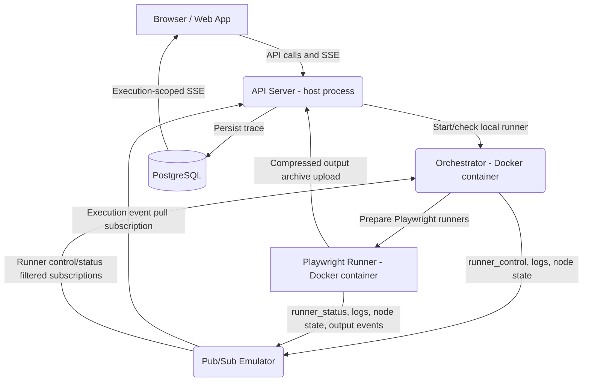

# Local Runner Architecture

The local runner uses the same runner messaging shape as GCP, but swaps managed
cloud services for local Docker services. Workflow messages go through the
Docker-backed Pub/Sub emulator, and the API persists accepted execution events
to PostgreSQL before streaming them to the editor.

## Architecture at a Glance

## Services

1. **Web App**: Runs on the host through Vite and talks to the API through the
   local `/api/*` proxy.
2. **API Server**: Runs on the host, starts/checks the local Orchestrator,
   creates local Pub/Sub emulator topics/subscriptions, persists execution
   events to PostgreSQL, and serves the editor SSE stream.
3. **Pub/Sub Emulator**: Runs through `docker-compose.yml` and provides the same
   topic/subscription workflow used by the GCP runner path.
4. **Orchestrator**: Runs as the `playrunner-orchestrator-local` Docker
   container on port `3012`. It receives workflow execution requests, prepares
   Playwright runners early, and starts them with Pub/Sub `runner_control`
   messages when the DAG reaches their nodes.
5. **Playwright Runner**: Runs as an ephemeral Docker container. It prepares
   dependencies, publishes `runner_status=ready`, waits for a Pub/Sub start
   signal, runs the test, uploads local output archives to the API, and publishes
   output events through Pub/Sub.

## Startup Flow

1. `./start-local.sh` starts Postgres and the Pub/Sub emulator.
2. The editor mounts and calls `POST /api/runners/start`.
3. The API checks the Orchestrator's `/health` and `/runtime` endpoints.
4. If no compatible runner is running, the API starts
   `playrunner-orchestrator-local` with `PUBSUB_EMULATOR_HOST` and
   `GCP_PUBSUB_WORKFLOW_EVENTS_TOPIC` injected.
5. If a stale container is still bound to port `3012` but does not expose the
   expected Pub/Sub runtime metadata, the API stops it and starts a fresh
   Orchestrator container from the current image.

## Workflow Execution Flow

1. The editor sends `POST /api/workflows/start`.
2. The API creates the execution record, configures the execution-scoped Pub/Sub
   subscription in the emulator, and sends the workflow to the local
   Orchestrator's `/execute` endpoint.
3. The Orchestrator scans the full workflow for Playwright nodes and starts
   their runner containers in preparation mode.
4. Each Playwright runner clones/installs/prepares, then publishes
   `runner_status=ready` and waits.
5. When DAG traversal reaches a Playwright node, the Orchestrator publishes
   `runner_control=start` with the `testId` and `nodeId`.
6. The runner publishes `started`, log, node-state, output, and terminal events
   through the Pub/Sub emulator.
7. The API pulls execution events from the emulator, writes them to PostgreSQL,
   and streams the same run to the editor over SSE.

## What Still Uses HTTP Locally

Runner messages do not use API event signalling. The local API still uses HTTP
for normal editor REST requests, the execution SSE stream, the Orchestrator
`/execute` request, and local compressed output archive uploads from the
Playwright runner.

## Shared Shape with GCP

Local and GCP runners both use the same `eventTransport` and `runnerControl`
payload shape. Local development varies only by environment:

- `PUBSUB_EMULATOR_HOST` points the Pub/Sub client at the emulator.
- `LOCAL_PUBSUB_PROJECT_ID` defaults local emulator resources to
  `playrunner-local`.
- `PUBSUB_EMULATOR_HOST_DOCKER` points Docker containers at the host emulator,
  usually `host.docker.internal:8084`.

That keeps the local path close to the GCP runner path while avoiding duplicate
local-only control/status code.
