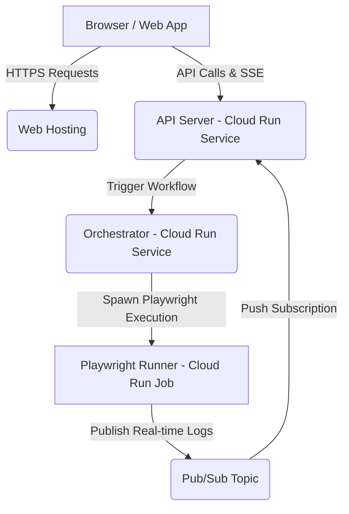

# Google Cloud Platform (GCP) Architecture

Playrunner is designed to be easily deployable to Google Cloud Platform, providing a massively scalable, auto-scaling execution environment for your visual Playwright workflows.

---

## Architecture at a Glance

When deployed to GCP, the local docker-based services are mapped directly to scalable serverless infrastructure:

## Service Breakdown

1. **API Server (Cloud Run Service)**: Handles HTTP requests from the frontend, manages authentication, proxies to Jira/Github integrations, and maintains Server-Sent Events (SSE) connections to stream live logs to the browser.
2. **Orchestrator (Cloud Run Service)**: A lightweight Node.js event-loop dispatcher that traverses your visual workflow graphs. It manages state, evaluates dependencies, and triggers the actual Playwright tests using Cloud Run Job executions.
3. **Playwright Runner (Cloud Run Job)**: The heavy lifter. A Docker container bundled with browsers and the Playwright framework. The Orchestrator passes execution context (payloads and environment variables) to these Jobs.
4. **Pub/Sub**: Facilitates asynchronous, real-time log streaming from the Playwright Runner back to the API Server, which then streams them via SSE to the user's browser.

> **Debugging cloud runs locally?** When the API is running on your machine, cloud runners cannot reach `localhost` to send logs and results back. See [Remote Debugging (Cloud Runners + Tunnel)](./local-dev/10-remote-debugging) for how Playrunner bridges this with an automatic Cloudflare tunnel.

---

## Dynamic Provisioning & Authentication

A key benefit of the Playrunner architecture is that **you do not need to manually deploy the Orchestrator Service**.

What Playrunner does **not** do for you is build or push container images.
Cloud Run still needs published images for the Orchestrator service and the
Playwright runner jobs before runtime provisioning can succeed. The repo ships
`infra/gcp/scripts/push-runners.sh` to do this — see
[Publishing to GCP](./local-dev/06-docker-images#publishing-to-gcp).

When a user initiates a workflow from the web interface targeting GCP:

1. **On-the-fly Provisioning**: The Node.js API Server automatically checks if the `playrunner-orchestrator` Cloud Run Service exists in the user's selected GCP project. If not, it uses the `@google-cloud/run` SDK to dynamically create and configure the service on the fly.
2. **Stateless Authentication**: The API Server passes the workflow payload to the Orchestrator, which securely injects the user's OAuth2 access token into the payload.
3. **Impersonation-less Execution**: The Orchestrator, running in Cloud Run, uses this OAuth2 token to instantiate its own GCP clients (`JobsClient`, `ExecutionsClient`). This ensures that the Orchestrator runs exactly as the authenticated user, without requiring complex IAM role assignments to the default Compute Engine Service Account.

In practice that means:

- `GCP_ORCHESTRATOR_IMAGE_URI_TEMPLATE` must point at an Orchestrator image that is already available in a registry Cloud Run can pull from.
- `GCP_PLAYWRIGHT_IMAGE_URI_TEMPLATE` must point at Playwright runner images that are already available in a registry Cloud Run can pull from.
- `GCS_BUCKET_PREFIX` controls the per-workflow output buckets Playrunner creates before handing execution off to Cloud Run.

The Terraform under `infra/gcp` creates Artifact Registry repositories named
`orchestrator` and `playwright-runner`, which match the default examples used in
the env-var docs.

---

## Understanding Concurrency & Isolation

A common point of confusion when deploying to GCP is how **Cloud Run Service Concurrency** interacts with **Workflow Node Concurrency**.

### 1. Cloud Run Service Concurrency (Infrastructure-Level)

Cloud Run Services have a setting called `maxInstanceRequestConcurrency` (or `--concurrency` in the gcloud CLI). This limits the number of incoming HTTP requests a single container can handle simultaneously.

- **API Server & Orchestrator**: By default, this is set to **80**. Because the Orchestrator is merely a lightweight graph dispatcher, a single container instance can comfortably manage up to 80 different workflow executions simultaneously without performance degradation.

### 2. Playwright Job Execution (Job-Level)

When the Orchestrator hits a Playwright node, it uses the Google Cloud SDK to trigger a new **Cloud Run Job Execution**.

- Each Job Execution spawns in a **brand new, totally isolated container**.
- Environment variables configured in your workflow are injected dynamically into this specific container via `envOverrides`. Therefore, **there is zero environment collision risk** between concurrent workflows or concurrent nodes.

### 3. Workflow Node Concurrency (Application-Level)

In the Workflow Editor, you can specify a **Concurrency Limit** (e.g., `1`, `3`, `10`). This instructs the Orchestrator on how many _internal_ parallel nodes to process simultaneously within a single workflow diagram.

- **Shared vs Isolated State**: Even though the Playwright Job containers are isolated at the infrastructure level, you may be interacting with external shared state (like a staging database).
- If you want multiple Playwright branches within your workflow to execute **in parallel** (isolated from each other infrastructurally, but hitting your external targets simultaneously), you set a higher workflow concurrency (e.g., `10`).
- If you need strict, **sequential** execution to avoid race conditions on your external shared resources, you simply set your workflow concurrency to `1`.

Because environment variables are scoped into a localized memory object (`globalEnvVars`) per orchestrator execution and injected securely into the Cloud Run Jobs, your workflows remain completely isolated, giving you complete application-level control without needing to tweak infrastructure deployments.
