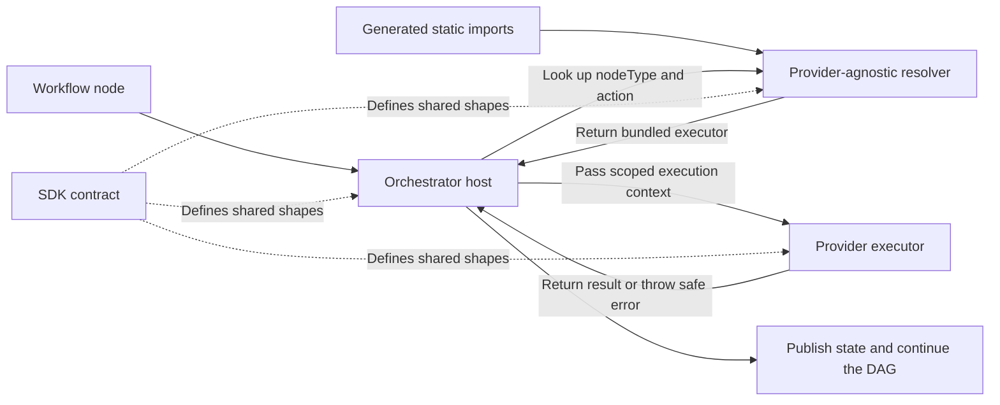

# Orchestrator Contributions

> **Build-time only.** Executable integration code is selected, installed, and
> bundled while the Orchestrator image is built. A running Playrunner instance
> never downloads, installs, or hot-loads marketplace packages.

An executable integration can own its provider-specific workflow behavior under
`src/orchestrator/`. The Orchestrator host still owns workflow policy, lifecycle,
transport, and state publication.

## Build time and runtime

These are deliberately separate operations:

| Build time                                                             | Runtime                                                                |
| ---------------------------------------------------------------------- | ---------------------------------------------------------------------- |
| Select the trusted integration packages included in the deployment.    | Connect OAuth, tokens, webhooks, or other provider settings.           |
| Install package dependencies and update lockfiles.                     | Add an already-bundled integration node to a workflow.                 |
| Generate static imports from package-owned manifest metadata.          | Select the node action and configure its fields.                       |
| Rebuild the Orchestrator image, then push and redeploy it when needed. | Resolve and execute the bundled handler without changing the artifact. |

Adding a node or connecting its settings does not install code. Changing the
installed package set or any executor implementation requires a new Orchestrator
build. GCP deployments also require the rebuilt image to be pushed and rolled
out.

## Architecture

These are four **code ownership layers**, not four running services. Only
`apps/runners/orchestrator` starts a server. The SDK, package contribution,
generated composition, and host code are bundled into the same `dist/index.js`
file and Docker image.

The shortest way to understand the split is:

| Layer                                                | Plain-language role                                                                                                          |
| ---------------------------------------------------- | ---------------------------------------------------------------------------------------------------------------------------- |
| `@playrunner/integration-sdk/orchestrator`           | The rulebook: defines the shapes that the host and every provider must agree on.                                             |
| `@playrunner/<integration-id>/orchestrator`          | The self-contained provider adapter: owns its manifest declaration, validation, API requests, progress messages, and output. |
| `infra/scripts/generate-integration-composition.mjs` | The build composer: reads installed direct production dependencies and generates static imports for their declared surface.  |
| `apps/runners/orchestrator`                          | The workflow engine: validates and resolves the generated contributions, then owns scheduling, lifecycle, and transport.     |

`@playrunner/integration-registry/orchestrator` is a provider-agnostic helper
used by the host layer. It validates contribution contracts and resolves exact
node/action keys. It does not import Jira, Slack, or any other provider, and it
does not maintain an allowlist.

At runtime, a package-owned node follows this path:



The lookup does not fetch code. It returns a function that the generated module
already imported and the build bundled into the deployed image.

### 1. SDK contract: the shared rulebook

`@playrunner/integration-sdk/orchestrator` contains TypeScript contracts and a
contract version. It does not execute workflows, call provider APIs, or decide
which integrations are installed.

It defines:

- what a contribution must export: an ID, contract version, and one or more
  executors;
- how an executor identifies the persisted `nodeType` and optional action it
  handles;
- the controlled context the host passes to an executor, including the current
  node, provider-scoped settings, environment and workflow snapshots, template
  rendering, logging, and an `AbortSignal`; and
- the result an executor may return: `success` or `warning`, with optional
  output.

The version lets the provider-agnostic validator reject a package built for an
incompatible contract instead of attempting to run it with the wrong context
or result shape.

### 2. Integration contribution: the provider adapter

`@playrunner/<integration-id>/orchestrator` contains the code that is unique to
one provider. For example, the Jira contribution knows Jira request URLs,
payloads, access-token requirements, create/update actions, and safe Jira error
messages. The Slack contribution knows incoming webhooks and the Slack Bot API.

The provider contribution owns:

- provider-specific node validation;
- rendering and validating provider fields;
- provider API requests;
- provider-specific progress messages; and
- converting a provider response into a safe executor result or error.

It does not walk the workflow graph, choose the next node, publish terminal node
state, read credentials belonging to other integrations, or manage execution
timeouts. Those remain host responsibilities.

### 3. Build composition: package metadata becomes static imports

Each self-contained package declares its Playrunner ID and public surfaces in
its own `package.json`. During the app or image build,
`infra/scripts/generate-integration-composition.mjs` examines only the app's
installed direct `dependencies` and `optionalDependencies`. For the requested
surface, it validates the package metadata and export, rejects duplicate IDs,
sorts the packages deterministically, and writes a generated TypeScript module
containing normal static imports.

The Orchestrator passes those generated contributions to
`@playrunner/integration-registry/orchestrator`. That library has two generic
jobs:

1. At startup, validate contribution IDs, contract versions, executor keys, and
   default actions so ambiguous or incompatible contributions fail early.
2. During workflow execution, resolve an exact persisted `nodeType` and optional
   `config.action` to one of the functions already held in memory.

This preflight checks that executable code exists for the saved node and action.
It does not authenticate with the provider or validate credentials and provider
fields. Jira, Slack, and future contributions perform those checks when their
node is actually reached and executed.

There is no handwritten provider list to update. A package author changes only
their package: metadata, exports, and implementation. The deployment's build
selection still has to install the package as a direct production dependency of
each app that consumes a declared surface. The build then regenerates its
composition and bundles it. A running process never scans `node_modules`,
queries a marketplace, runs a package manager, downloads an executor, or uses a
dynamic import to activate provider code.

### 4. Orchestrator host: the workflow engine

`apps/runners/orchestrator` is the only running layer in this model. It receives
the workflow, checks that every executable node can be handled, and then walks
the DAG according to the saved connections.

For a package-owned node, the host:

1. resolves the executor through the generated composition and generic resolver
   during preflight;
2. publishes the node's starting state when its place in the DAG is reached;
3. creates a read-only execution context containing only that provider's
   settings and the capabilities allowed by the SDK;
4. enforces timeout and cancellation through the host-owned `AbortSignal`;
5. invokes the provider executor; and
6. publishes output and terminal state, records failure, runs cleanup, and
   decides which connected nodes are eligible to run next.

This keeps workflow policy consistent across every integration. Provider
packages implement provider behavior without each package reimplementing DAG
traversal, event transport, cancellation, or state management.

### Example: running a Jira create node

The build and the workflow run are separate:

1. **Build:** Jira is a production dependency of the Orchestrator. Its own
   manifest declares `./orchestrator`; the build composer generates a static
   import and the resulting code is bundled into the image.
2. **Configure:** A user connects Jira, adds a Jira node, connects it in the
   workflow, chooses the `create` action, and fills in the project, summary, and
   description. This changes credentials and workflow data, not installed code.
3. **Preflight:** The host asks the generic resolver for `nodeType: "jira"` and
   action `"create"`. It returns the Jira create executor already bundled in
   memory. An unsupported action fails here.
4. **Execute:** The host passes the executor only `settings.jira`, the Jira node,
   template data, a logger, and an `AbortSignal`. The Jira package renders the
   fields and calls Jira's API.
5. **Finish:** The Jira executor returns `success` or throws a safe error. The
   host publishes the final node state, records any workflow failure, cleans up,
   and continues through eligible connections.

The shared contract also allows an executor to return `warning` or an optional
output payload. The current Jira and Slack executors return `success` without an
output payload; the host support is available for contributions that need it.

### What "host-managed" means today

Jira and Slack currently declare and default-export Orchestrator contributions.
Environment, Playwright, Schedule, and GitHub are listed in
`HOST_MANAGED_NODE_TYPES`, so the host recognizes them during preflight and runs
their existing explicit branches instead of resolving them through the
generated package composition.

In the current host implementation:

- Environment values are collected before DAG traversal, while Environment and
  Schedule nodes run as host workflow steps.
- Playwright preparation, start signalling, monitoring, and child-runner
  lifecycle remain host-managed. The Playwright tests run in their own prebuilt
  runner image.
- GitHub follows a direct host branch that checks whether credentials are
  available and reports the result.

That does **not** mean those integrations are installed at runtime. The
host-side branches that execute those node types are compiled into the
Orchestrator image. "Host-managed" only means their execution path has not been
moved behind the package contribution contract. Moving one of those paths into
a package later would change where its provider behavior lives, while the host
would continue to own DAG scheduling, state, transport, timeout, cancellation,
and cleanup.

### Why keep these boundaries

- **Predictable deployments:** the executable package set is visible in app
  dependencies, lockfiles, generated build output, the image, and `/runtime`
  diagnostics.
- **Least privilege:** a Jira executor receives Jira settings, not Slack, GCP,
  or GitHub credentials and not event-transport controls.
- **Consistent workflow behavior:** one host owns state transitions, failure
  propagation, cancellation, and cleanup for every provider.
- **Early failures:** incompatible versions, duplicate contributions, missing
  executors, and unsupported actions fail explicitly rather than falling back
  to a label or silently succeeding.

## Package layout and export

Executable packages add a server-only entrypoint alongside their frontend and
API surfaces:

```text
packages/<integration-id>/
├── assets/
├── package.json
└── src/
    ├── frontend/
    │   └── index.tsx
    ├── api/
    │   └── index.ts
    └── orchestrator/
        └── index.ts
```

Declare the integration and its surfaces in the package's own manifest, and
expose each declared entrypoint with the TypeScript source export conditions
used by the repo's consumers:

```json
{
  "playrunner": {
    "integration": {
      "id": "example",
      "frontend": ".",
      "api": "./api",
      "orchestrator": "./orchestrator"
    }
  },
  "exports": {
    "./orchestrator": {
      "types": "./src/orchestrator/index.ts",
      "import": "./src/orchestrator/index.ts",
      "require": "./src/orchestrator/index.ts",
      "default": "./src/orchestrator/index.ts"
    }
  }
}
```

## Contribution example

```ts
import {
  createOrchestratorContribution,
  ORCHESTRATOR_CONTRACT_VERSION,
} from "@playrunner/integration-sdk/orchestrator";

export const exampleOrchestratorContribution = createOrchestratorContribution({
  contractVersion: ORCHESTRATOR_CONTRACT_VERSION,
  id: "example",
  executors: [
    {
      nodeType: "example",
      action: "send",
      default: true,
      validate: ({ node, settings }) => {
        if (!settings.accessToken) {
          throw new Error("Example credentials are missing.");
        }
        if (!node.config.message) {
          throw new Error("Example message is required.");
        }
      },
      execute: async ({ node, settings, renderTemplate, log, signal }) => {
        const message = renderTemplate(String(node.config.message));

        await log("Sending example message...", "info");
        await sendExampleMessage({
          accessToken: String(settings.accessToken),
          message,
          signal,
        });

        return { outcome: "success" };
      },
    },
  ],
});

export default exampleOrchestratorContribution;
```

Every surface declared in `playrunner.integration` must default-export its
contribution. Named exports can remain for direct consumers and tests. An
executor returns `success` or `warning`. It throws a safe, user-facing error
when execution fails; the host normalizes that exception and publishes the
terminal error state.

## Resolution rules

- `node.nodeType` is the persisted integration ID used for executor lookup.
- `node.config.action`, when present, must match an executor action exactly.
- A default executor is used only when the persisted node has no action.
- Resolution never falls back to the node's display label.
- `Integration.nodeType` in the frontend contract is only a selector category
  (`trigger`, `action`, or `config`). It is not the persisted integration ID.
- Duplicate contribution IDs, duplicate executor keys, multiple defaults,
  malformed contributions, and unsupported contract versions stop startup.
- A missing executor or unsupported action fails preflight with an
  `executor not installed/registered` error. It does not silently succeed.

## Executor capabilities

The host supplies each executor with:

- its execution ID and optional workflow ID;
- the current node ID, persisted integration ID, and node configuration;
- only that contribution's provider settings;
- read-only environment and workflow snapshots;
- host-owned template rendering and logging functions; and
- an `AbortSignal` controlled by the host timeout and stop path.

Executors do not receive the full workflow request, other integrations'
credentials, event publishers, transport credentials, DAG routing functions, or
node-state mutation functions.

## Host-owned lifecycle

The Orchestrator preflights every executable node before starting the DAG. Each
package invocation then runs inside host-owned `try/catch/finally` handling. The
host always performs terminal-state publication and bookkeeping, including when
an executor throws, times out, or is cancelled.

Active package executions are keyed by both `executionId` and `nodeId`. This
allows concurrent workflow runs to contain the same persisted node ID without
their cancellation state colliding.

## Adding an executable package

Package authors only modify their own package:

1. Add `src/orchestrator/index.ts` and the exact `./orchestrator` package export.
2. Add `playrunner.integration.id` and
   `playrunner.integration.orchestrator` to that package's `package.json`.
3. Default-export the contribution from the declared entrypoint; named exports
   may remain.
4. Run the package checks and publish the new package version.

The operator or build pipeline then selects that package for an artifact:

1. Add the package version as a direct production dependency of
   `apps/runners/orchestrator` and update its lockfile.
2. Build the Orchestrator. The build-time composer discovers the package-owned
   metadata and generates the static import automatically.
3. Rebuild and replace the local image, or push and redeploy the image for GCP.

Neither the package author nor the operator adds a provider reference to
`@playrunner/integration-registry`. Do not add runtime package-install or
discovery logic.

## Validation

Run the package checks first:

```bash
npm run typecheck --prefix packages/<integration-id>
npm run lint --prefix packages/<integration-id>
npm run format:check --prefix packages/<integration-id>
(cd packages/<integration-id> && npm pack --dry-run --json)
```

Then verify build composition, generic resolution, host lifecycle, and the
production bundle:

```bash
npm test --prefix apps/runners/orchestrator
npm run typecheck --prefix apps/runners/orchestrator
npm run lint --prefix apps/runners/orchestrator
npm run build --prefix apps/runners/orchestrator
node --check apps/runners/orchestrator/dist/index.js
```

For a local image test:

```bash
./infra/scripts/rebuild-orchestrator.sh
```

Reopen the Editor so the API starts a container from the rebuilt image, then
inspect the bundled contribution IDs and contract versions:

```bash
curl --silent http://localhost:3012/runtime
```

`orchestratorContributions` lists each contribution's contract version and
registered action/default executors. `activePackageExecutorCount` reports
in-flight package executions, and `orchestratorExecutorTimeoutMs` reports the
host timeout applied to each invocation.

For GCP, build, push, and redeploy the Orchestrator image after the local test
passes:

```bash
./infra/gcp/scripts/push-runners.sh --target orchestrator --yes
```

The running `/runtime` response is the deployment check. If the expected
contribution is absent, the selected package was not included in that image.

## Trust boundary

Package executors run inside the privileged Orchestrator process. The static
build composition is therefore only for trusted packages selected as direct
production dependencies by the deployment. Running arbitrary third-party
marketplace code requires a separate isolation, signing, capability, and
rollback design; it must not be implemented as runtime download or direct
hot-loading into this process.
