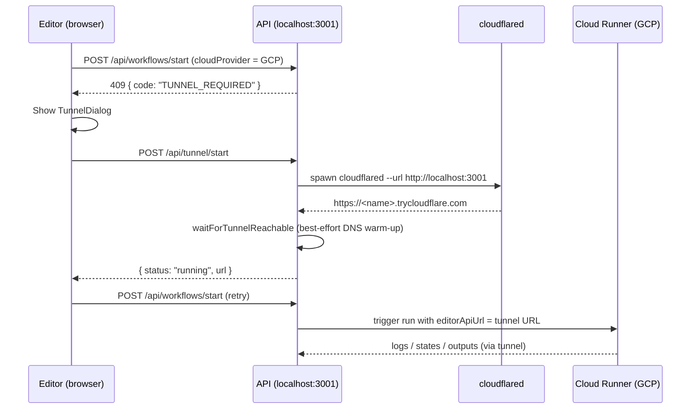

# Remote Debugging with Cloud Runners

> **Local development only.** This describes how to debug a **cloud** workflow run (e.g. the GCP runner) while the Playrunner API is running on your own machine.

---

## The Problem

When you run a workflow locally, every service is on `localhost` and the Playwright runner reaches the API at `http://host.docker.internal:3001`.

A **cloud** runner is different. The Orchestrator and Playwright Runner execute inside GCP (Cloud Run), and they call **back** to your API to publish logs, node states, and outputs. They need a **publicly reachable address** for your API — and `http://localhost:3001` is not reachable from GCP.

If the API only knows about a local host and no public address is configured, it cannot hand the runner a usable callback URL, so the run would fail mid-execution. To avoid that, the API detects the situation **up front** and asks the editor to open a tunnel first.

---

## The Flow



### 1. The 409 `TUNNEL_REQUIRED` signal

When a workflow targets a cloud provider, the API resolves a callback URL in `resolveEditorApiUrl` (`apps/api/src/runtime/gcp-workflow-execution.ts`):

1. If `EDITOR_API_PUBLIC_URL` is set, use it (no tunnel needed).
2. Else, if a tunnel is already active, use the tunnel URL.
3. Else, if the request host is local (`localhost`, `127.0.0.1`, `host.docker.internal`), return **`409 { code: "TUNNEL_REQUIRED" }`**.
4. Otherwise use the request's own host.

### 2. The editor opens the dialog

The editor's `runWorkflow` catches the `TUNNEL_REQUIRED` code, stashes the pending run, and opens `TunnelDialog` (`apps/frontend/src/components/TunnelDialog.tsx`). The dialog explains that cloud runners need a public address and reminds you to install `cloudflared`.

### 3. Starting the tunnel

"Start tunnel" calls `POST /api/tunnel/start`. The `tunnelService` (`apps/api/src/services/tunnel.ts`):

1. Verifies `cloudflared` is installed and on your `PATH`.
2. Spawns `cloudflared tunnel --no-autoupdate --url http://localhost:3001`.
3. Parses the assigned `https://<name>.trycloudflare.com` URL from cloudflared's output.
4. **Best-effort waits for the URL to become publicly reachable** to give DNS time to propagate (see below).

### 4. The run resumes

When the dialog reports the tunnel is running, `handleTunnelStarted` replays the pending run. This time `resolveEditorApiUrl` returns the tunnel URL, which is passed to the runner as `editorApiUrl`, and logs/results stream back through the tunnel.

---

## The DNS warm-up gate

A freshly created `*.trycloudflare.com` name is registered the moment cloudflared prints it, but it is **not yet globally resolvable**. Handing it to a cloud runner immediately races DNS propagation — and a failed lookup (`ENOTFOUND` / `NXDOMAIN`) can be **negatively cached** for ~2 minutes, so the runner keeps failing even after the name goes live.

To smooth this over, `waitForTunnelReachable` waits a short initial delay (so the first probe doesn't poison the local resolver with an early `NXDOMAIN`), then polls `GET <url>/api/heartbeat` (up to 60s, every 2s). **Any** HTTP response — even a `404` — proves the public name resolves and routes through the tunnel to the local API; only network/DNS errors are retried.

This probe is **advisory, not fatal**. It runs against _your machine's_ resolver, whereas the cloud runner resolves through its own. So if local reachability can't be confirmed within the window, the tunnel still proceeds to `running` and logs a warning — the cloud runner may simply need a few more seconds for DNS to propagate.

---

## Requirements

- **`cloudflared`** must be installed and on your `PATH`. For example:
  ```bash
  brew install cloudflared
  ```
  See [Cloudflare's install guide](https://developers.cloudflare.com/cloudflare-one/connections/connect-networks/downloads/) for other operating systems. Playrunner cannot install OS tools for you.

---

## Skipping the tunnel

If your API is already reachable at a stable public address (for example a deployed environment or a permanent tunnel you manage yourself), set:

```bash
EDITOR_API_PUBLIC_URL=https://your-public-api.example.com
```

When this is set the API uses it directly and never asks for a tunnel.

---

## Endpoint reference

| Endpoint                 | Auth     | Purpose                                                                     |
| ------------------------ | -------- | --------------------------------------------------------------------------- |
| `POST /api/tunnel/start` | required | Start (or reuse) the cloudflared tunnel; returns `{ status, url }`          |
| `GET /api/tunnel/status` | required | Current tunnel state (`stopped` / `starting` / `running` / `error`) and URL |
| `POST /api/tunnel/stop`  | required | Stop the tunnel and clear its URL                                           |
| `GET /api/heartbeat`     | none     | Reachability probe used by the warm-up gate                                 |

---

## Troubleshooting

| Symptom                                                       | Cause / Fix                                                                                                                                          |
| ------------------------------------------------------------- | ---------------------------------------------------------------------------------------------------------------------------------------------------- |
| Dialog error: _cloudflared is not installed…_                 | Install `cloudflared` and ensure it's on your `PATH`, then retry.                                                                                    |
| Runner logs show `getaddrinfo ENOTFOUND …trycloudflare.com`   | DNS hadn't propagated yet. Wait a few seconds and re-trigger the run; if it persists, the tunnel URL may have changed — stop and restart the tunnel. |
| API log: _could not confirm public reachability … Proceeding_ | Advisory only — the local DNS probe didn't resolve in time but the tunnel is up. The cloud runner usually resolves it shortly after.                 |
| Dialog error: _cloudflared exited (code 1) …_                 | cloudflared failed to start; the message now includes its output. Check your network/firewall and that the API is listening on `:3001`.              |
| Cloud run still fails after tunnel is up                      | Confirm the run was **re-triggered** after the tunnel reported running (the editor does this automatically via the dialog).                          |
