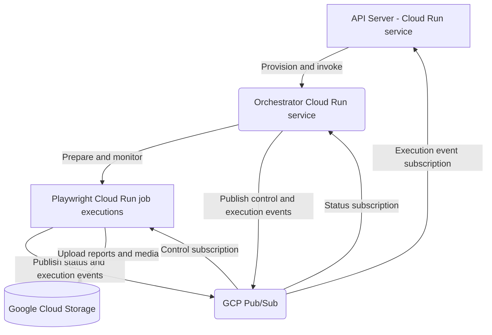

# Google Cloud Platform (GCP) Runner Architecture

The GCP runner implements the [shared runner architecture](../) with Cloud
Run, GCP Pub/Sub, and Google Cloud Storage. This page describes the GCP-specific
deployment, provisioning, authentication, and scaling model.

For setup, start with [GCP Setup](./setup), then use
[OAuth](./oauth), [Project & Region](./project-region), and
[Terraform](./terraform) for the individual configuration steps.

## GCP Deployment



| Shared concern    | GCP implementation                                                   |
| ----------------- | -------------------------------------------------------------------- |
| Orchestrator      | Cloud Run service                                                    |
| Playwright runner | Isolated Cloud Run job execution                                     |
| Messaging         | Shared GCP Pub/Sub workflow-events topic with filtered subscriptions |
| Output storage    | Per-workflow Google Cloud Storage bucket                             |
| Provisioning      | API uses the Cloud Run API and the saved GCP runner settings         |
| Authentication    | Connected user's GCP OAuth token                                     |

## Dynamic Provisioning and Authentication

The API checks whether the configured Orchestrator Cloud Run service exists and
creates or updates it when necessary. Saved GCP runner settings supply the
project, region, service name, instance settings, CPU idle policy, and image URI
templates.

Runtime provisioning does not build or publish images. Cloud Run must already
be able to pull the Orchestrator and Playwright runner images. Follow
[GCP Setup](./setup) for the required order and
[Publishing to GCP](../../local-dev/docker-images#publishing-to-gcp) for image
commands.

The API passes the connected user's OAuth token to the Orchestrator. The
Orchestrator uses that token for Cloud Run job operations and Pub/Sub messaging,
without relying on the default Compute Engine service account for user-scoped
runner operations. The connected user therefore needs permission to:

- create or update the Orchestrator Cloud Run service;
- run and inspect Playwright Cloud Run jobs;
- publish to the workflow-events topic;
- create and use execution, control, and status subscriptions;
- create and write workflow output buckets.

## Infrastructure and Images

Terraform under `infra/gcp` creates the Artifact Registry repositories and the
shared Pub/Sub workflow-events topic. At runtime, the API manages the filtered
execution subscription, while the Orchestrator manages the runner control and
status subscriptions.

The selected project and Cloud Run region should match the Terraform
`project_id` and `region`. Apply the Terraform when moving to infrastructure
that does not already contain the required repositories and topic.

Like every Orchestrator implementation, the GCP image statically bundles its
trusted package executors. Adding, upgrading, or removing an executor requires a
new Orchestrator image and deployment:

```bash
./infra/gcp/scripts/push-runners.sh --target orchestrator --yes
```

## Output Storage

Before invoking the Orchestrator, the API creates or selects the workflow's GCS
output bucket. `GCS_BUCKET_PREFIX` controls its naming prefix. Each Playwright
job uploads reports and media directly to GCS, then publishes a `node_output`
event containing their API-facing URLs.

## Cloud Run Scaling and Isolation

The Orchestrator is an asynchronous graph dispatcher: `/execute` acknowledges
the request immediately while the service continues the workflow in the
background. Its saved minimum instance count, maximum instance count, request
concurrency, and CPU idle policy control service availability and scaling.

Each Playwright node runs in a separate Cloud Run job execution with its own
environment overrides. Workflow graph parallelism still follows the
[shared DAG rules](../#concurrency-and-isolation); Cloud Run service request
concurrency does not determine which nodes inside a workflow run in parallel.

A local API can debug GCP runs by pulling their Pub/Sub execution events over
outbound HTTPS. No inbound tunnel to the local machine is required. See
[Remote Runner Messaging](../../local-dev/remote-debugging).
