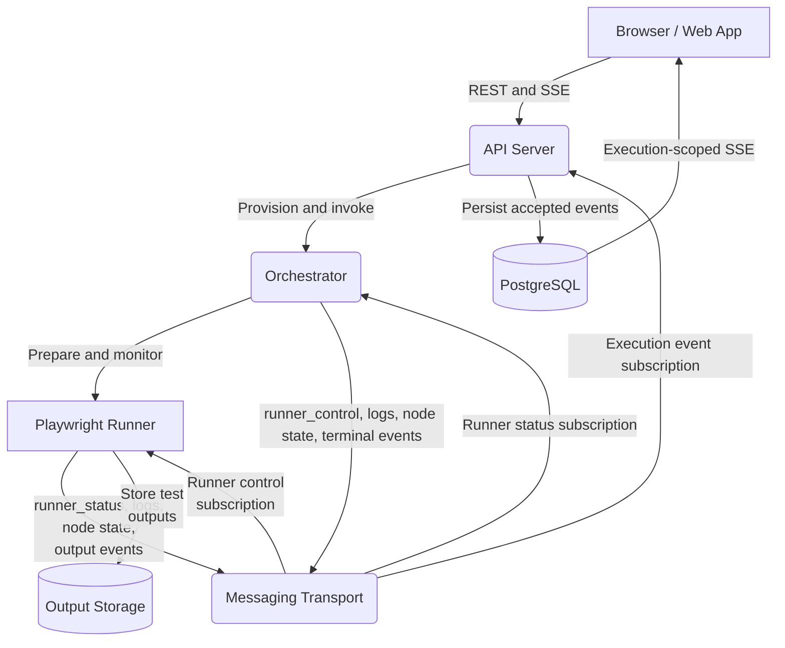

# Runner Architecture

Every Playrunner runner uses the same execution model. A provider implementation
chooses where the Orchestrator and Playwright runners run, which messaging
service carries runner messages, and where test outputs are stored.

The provider pages document those deployment choices:

- [Local](./local) uses Docker, the Pub/Sub emulator, and API-hosted outputs.
- [GCP](./gcp/) uses Cloud Run, GCP Pub/Sub, and Cloud Storage.
- [AWS](./aws/) and [Azure](./azure) are planned.

## Shared Architecture

### Component Responsibilities

1. **API Server** authenticates the user, creates the execution record and
   execution token, provisions the selected provider's Orchestrator when
   necessary, creates the execution event subscription, and invokes the
   Orchestrator.
2. **Orchestrator** traverses the workflow DAG, executes its statically bundled
   package contributions, prepares Playwright runners, and signals each runner
   when its node is eligible to start.
3. **Playwright Runner** prepares an isolated test environment, waits for its
   start signal, runs the test, transfers its report and media to the provider's
   output storage, and publishes the resulting output metadata.
4. **Messaging Transport** carries logs, node state, output events, and runner
   control/status messages. Runner messages are never sent through direct API
   event callbacks.
5. **PostgreSQL and SSE** provide the durable, ordered execution trace consumed
   by the editor. The API verifies and persists execution events before making
   them available to the browser.

## Shared Execution Lifecycle

1. The editor sends `POST /api/workflows/start` with the selected runner
   provider.
2. The API creates the execution, configures its event subscription, ensures the
   provider's Orchestrator is available, and invokes `/execute`.
3. The Orchestrator scans the workflow for Playwright nodes and begins preparing
   their isolated runners before DAG traversal reaches them.
4. Each Playwright runner prepares its repository and dependencies, publishes
   `runner_status=ready`, and waits for a control message.
5. When a Playwright node becomes eligible, the Orchestrator publishes
   `runner_control=start` and waits for the runner to acknowledge and complete.
6. The Orchestrator and runner publish execution events through the provider's
   messaging transport. The API validates them, writes them to PostgreSQL, and
   exposes them to the editor over execution-scoped SSE.
7. The runner transfers test outputs to the provider's storage path and
   publishes a `node_output` event containing their locations. After the DAG
   finishes, the Orchestrator publishes `workflow_completed` or
   `workflow_failed`.

Runner control and status messages share the transport with execution events,
but they are consumed by the Orchestrator/runner coordination path rather than
stored as user-facing execution events.

## Provider Mapping

| Concern              | Local                            | GCP                              |
| -------------------- | -------------------------------- | -------------------------------- |
| Orchestrator compute | Docker container                 | Cloud Run service                |
| Playwright compute   | Ephemeral Docker container       | Cloud Run job execution          |
| Messaging            | Docker-backed Pub/Sub emulator   | GCP Pub/Sub                      |
| Output storage       | API filesystem under `/outputs`  | Google Cloud Storage             |
| Provisioning         | API uses the local Docker daemon | API uses the Cloud Run API       |
| Runner credentials   | Local execution context          | Connected user's GCP OAuth token |

Provider implementations must preserve the shared event and runner-control
contracts. They vary infrastructure and configuration, not workflow semantics.

## Concurrency and Isolation

Workflow parallelism is determined by the DAG. Eligible sibling branches start
together; sequential connections wait for the preceding node to complete. Each
Playwright node receives its own runner environment, while external systems used
by the test may still contain shared state.

See [Connection Nodes](../local-dev/connection-nodes) for connection behavior.
