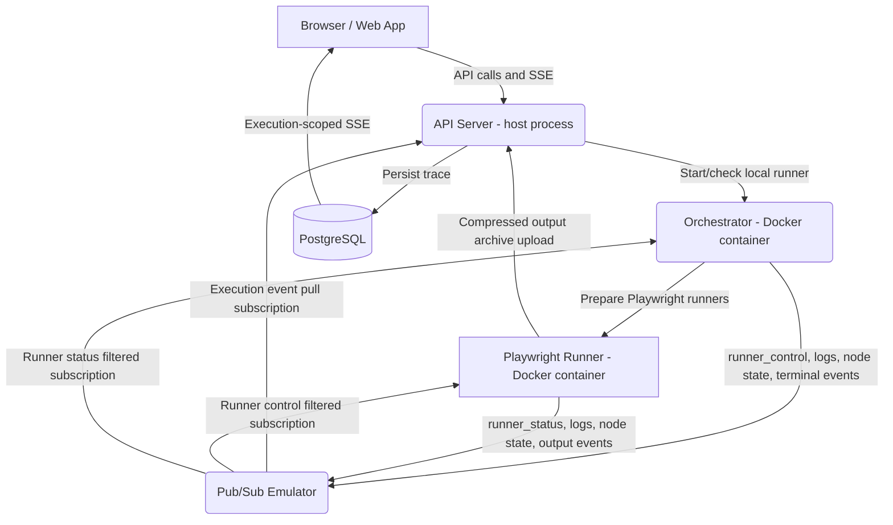

# Local Runner Architecture

The local runner uses the same runner messaging shape as GCP, but swaps managed
cloud services for local Docker services. Workflow messages go through the
Docker-backed Pub/Sub emulator, and the API persists accepted execution events
to PostgreSQL before streaming them to the editor.

## Architecture at a Glance

## Services

1. **Web App**: Runs on the host through Vite and talks to the API through the
   local `/api/*` proxy.
2. **API Server**: Runs on the host, starts/checks the local Orchestrator,
   creates local Pub/Sub emulator topics/subscriptions, persists execution
   events to PostgreSQL, and serves the editor SSE stream.
3. **Pub/Sub Emulator**: Runs through `docker-compose.yml` and provides the same
   topic/subscription workflow used by the GCP runner path.
4. **Orchestrator**: Runs as the `playrunner-orchestrator-local` Docker
   container on port `3012` by default. It receives workflow execution requests,
   prepares Playwright runners early, starts them with Pub/Sub `runner_control`
   messages when the DAG reaches their nodes, and executes package contributions
   such as Jira and Slack that were statically composed into the image at build
   time.
5. **Playwright Runner**: Runs as an ephemeral Docker container. It prepares
   dependencies, publishes `runner_status=ready`, waits for a Pub/Sub start
   signal, runs the test, uploads local output archives to the API, and publishes
   output events through Pub/Sub.

## Startup Flow

1. `./start-local.sh` starts Postgres and the Pub/Sub emulator.
2. When an authenticated editor mounts with `LOCAL_RUNNER` selected, it calls
   `POST /api/runners/start`.
3. The API checks the Orchestrator's `/health` and `/runtime` endpoints.
4. If no compatible runner is running, the API starts
   `playrunner-orchestrator-local` with `PUBSUB_EMULATOR_HOST` and
   `GCP_PUBSUB_WORKFLOW_EVENTS_TOPIC` injected.
5. If the service on port `3012` passes `/health` but does not expose the
   expected Pub/Sub runtime metadata, the API stops Docker containers publishing
   that port and starts a fresh Orchestrator container from the current image.

The Orchestrator image contains its trusted package executors at build time.
Each package declares its own Orchestrator surface and default export. The build
scans installed direct production dependencies and generates static imports;
there is no common provider list for a package author to update. Runtime users
can connect credentials and add or configure nodes that are already bundled,
but the local marketplace and workflow runner never discover, install, or
hot-load package code. After changing the selected executor set or its source,
rebuild the image with `./infra/scripts/rebuild-orchestrator.sh` and reopen the
Editor so the API starts a fresh container.

## Workflow Execution Flow

1. The editor sends `POST /api/workflows/start`.
2. The API creates the execution record, configures the execution-scoped Pub/Sub
   subscription in the emulator, and sends the workflow to the local
   Orchestrator's `/execute` endpoint.
3. The Orchestrator scans the full workflow for Playwright nodes and starts
   their runner containers in preparation mode.
4. Each Playwright runner clones/installs/prepares, then publishes
   `runner_status=ready` and waits.
5. When DAG traversal reaches a Playwright node, the Orchestrator publishes
   `runner_control=start` with the `testId` and `nodeId`.
6. The runner publishes `runner_status=started`, log, node-state, and output
   messages through the Pub/Sub emulator.
7. After the DAG finishes, the Orchestrator publishes the terminal
   `workflow_completed` or `workflow_failed` event.
8. The API pulls execution events from the emulator, writes them to PostgreSQL,
   and streams the same run to the editor over SSE. Runner control and status
   messages are acknowledged but are not persisted as execution events.

## What Still Uses HTTP Locally

Runner messages do not use direct API event callbacks. Application-level HTTP
is still used for:

- browser-to-API REST requests, execution SSE, and output/report downloads;
- API-to-Orchestrator `/health`, `/runtime`, `/execute`, and `/stop` requests;
- compressed output archive uploads from the Playwright runner to the API.

The local Pub/Sub clients also reach the emulator through its HTTP JSON API.
Those requests implement Pub/Sub publish, pull, acknowledgement, and resource
management semantics; they are not runner-to-API event signalling.

## Shared Shape with GCP

Local and GCP runners both use the same `eventTransport` and `runnerControl`
payload shape. For that shared Pub/Sub messaging path, local development varies
by environment and configuration:

- `PUBSUB_EMULATOR_HOST` points the Pub/Sub client at the emulator.
- `LOCAL_PUBSUB_PROJECT_ID` defaults local emulator resources to
  `playrunner-local`.
- `PUBSUB_EMULATOR_HOST_DOCKER` points Docker containers at the host emulator,
  usually `host.docker.internal:8084`.

That keeps the local path close to the GCP runner path while avoiding duplicate
local-only control/status code.
