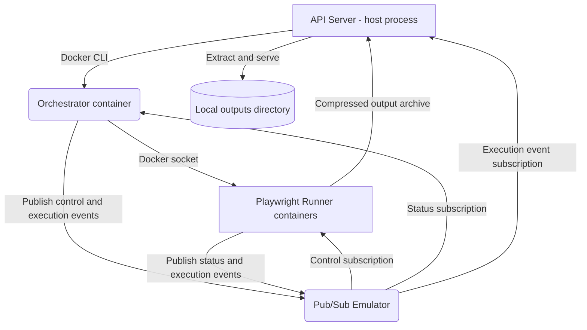

# Local Runner Architecture

The local runner implements the [shared runner architecture](./) with
Docker services on the developer machine. This page describes only the local
deployment and operational differences.

## Local Deployment



| Shared concern    | Local implementation                                                                  |
| ----------------- | ------------------------------------------------------------------------------------- |
| Orchestrator      | `playrunner-orchestrator-local` Docker container, published on port `3012` by default |
| Playwright runner | Ephemeral Docker container using the selected TypeScript or Python Playwright image   |
| Messaging         | Pub/Sub emulator from `docker-compose.yml`                                            |
| Output storage    | API filesystem under `apps/api/public/outputs`                                        |
| Provisioning      | API calls the local Docker daemon                                                     |
| Browser/API       | Vite proxies local `/api/*` requests to the host API process                          |

## Local Startup

1. `./start-local.sh` starts PostgreSQL and the Pub/Sub emulator and builds the
   local Orchestrator and Playwright images.
2. When an authenticated editor mounts with `LOCAL_RUNNER` selected, it calls
   `POST /api/runners/start`.
3. The API checks the Orchestrator's `/health` and `/runtime` endpoints.
4. If no compatible Orchestrator is running, the API starts
   `playrunner-orchestrator-local` with access to the Docker socket and the
   emulator configuration.
5. If the service on the Orchestrator port passes `/health` but reports
   incompatible runtime metadata, the API stops Docker containers publishing
   that port and starts the current image.

The local API and Orchestrator communicate over HTTP for lifecycle operations
such as `/health`, `/runtime`, `/execute`, and `/stop`. Runner events and
control/status messages use the Pub/Sub emulator.

## Docker Image Composition

The Orchestrator image contains its trusted package executors at build time.
Each package declares its own Orchestrator surface and default export, and the
build generates static imports from installed direct production dependencies.
The marketplace and workflow runtime do not discover, install, or hot-load
package code.

After changing an executor dependency or its source, rebuild and replace the
local Orchestrator image:

```bash
./infra/scripts/rebuild-orchestrator.sh
```

Reopen the editor after the rebuild so the API starts a container from the new
image.

## Local Output Handling

Playwright runners compress `playwright-report` and `test-results` and upload the
archive to the API. The API authenticates the upload with the execution token,
extracts it under `apps/api/public/outputs`, and returns the report and media
URLs. The runner then publishes the `node_output` event through the emulator.

## Local Messaging Configuration

- `PUBSUB_EMULATOR_HOST` points the host API at the emulator.
- `LOCAL_PUBSUB_PROJECT_ID` defaults emulator resources to
  `playrunner-local`.
- `PUBSUB_EMULATOR_HOST_DOCKER` points Docker containers at the host emulator,
  usually `host.docker.internal:8084`.
- `ORCHESTRATOR_PORT` changes the host port published by the local Orchestrator;
  it defaults to `3012`.
